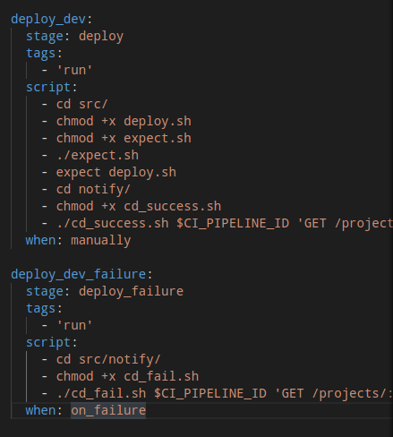

## Part 1. Готовый докер

* Поднять виртуальную машину Ubuntu Server 20.04 LTS

* Скачать и установить на виртуальную машину gitlab-runner

* Запустить gitlab-runner и зарегистрировать его для использования в текущем проекте (DO6_CICD)

")

## Part 2. Сборка

* Написать этап для CI по сборке приложений из проекта C2_SimpleBashScripts:

* В файле gitlab-ci.yml добавить этап запуска сборки через мейк файл из проекта C2

* Файлы, полученные после сборки (артефакты), сохранять в произвольную директорию со сроком хранения 30 дней.

## Part 3. Тест кодстайла

* Написать этап для CI, который запускает скрипт кодстайла (clang-format):

:")

* Если кодстайл не прошел, то "зафейлить" пайплайн

* p.s. Mой кодстайл прошел, ошибок не было

* В пайплайне отобразить вывод утилиты clang-format

## Part 4. Интеграционные тесты

* Написать этап для CI, который запускает ваши интеграционные тесты из того же проекта:

* Запускать этот этап автоматически только при условии, если сборка и тест кодстайла прошли успешно

* Если тесты не прошли, то "зафейлить" пайплайн

* В пайплайне отобразить вывод, что интеграционные тесты успешно прошли / провалились

## Part 5. Этап деплоя

* Поднять вторую виртуальную машину Ubuntu Server 20.04 LTS

* На машине 1:
   * Включить дополнительный адаптер внутренняя сеть
   * Задать ip 10.12.96.0 машины 1, отредактировав конфиг netplan
   * установить expect - printf "student\n" | sudo -S apt install expect -y

* На машине 2:
   * Включить дополнительный адаптер внутренняя сеть
   * Задать ip 192.168.1.2 машины 2, отредактировав конфиг netplan
   * дать права в том числе на запись - sudo chmod +x /usr/local/bin/

* Написать этап для CD, который "разворачивает" проект на другой виртуальной машине:

* Запускать этот этап вручную при условии, что все предыдущие этапы прошли успешно

* Написать bash-скрипт, который при помощи ssh и scp копирует файлы, полученные после сборки (артефакты), в директорию /usr/local/bin второй виртуальной машины

 into the /usr/local/bin directory of the second virtual machine using ssh and scp")

* В файле gitlab-ci.yml добавить этап запуска написанного скрипта

* В случае ошибки "зафейлить" пайплайн

* Сохранить дампы образов виртуальных машин

## Part 6. Дополнительно. Уведомления

* Настроить уведомления о успешном/неуспешном выполнении пайплайна через бота с именем "[ваш nickname] DO6 CI/CD" в Telegram

* Текст уведомления должен содержать информацию об успешности прохождения как этапа CI, так и этапа CD.

* В остальном текст уведомления может быть произвольным.

